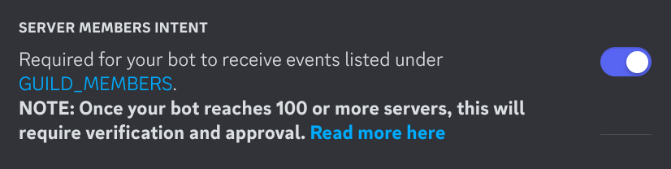

    
    <h2>nano</h2>
    

        the cutest robot girl, now as a discord bot!
    

> [!IMPORTANT]
> nano is currently in development! everything seen here is highly subject to
> change and things may break

## running

### creating an application

before proceeding, you must have setup an application at the [discord developer portal](https://discord.com/developers/applications)

once you have done so, make sure you have enabled the required **server members
intent**

### setting up the bot

first of all, clone this repo locally somewhere into your computer, then install
dependencies by running `pnpm install`

once you have all dependencies installed, you may configure the bot by copying
the [`src/config.default.ts`](src/config.default.ts) file as `config.ts` and
fill in any required fields. you can read the definition for the configuration
object at [`src/types/config.ts`](src/types/config.ts)

once you have filled the configuration object, you may want to deploy the app
commands first, so that you can actually interact with the bot once it starts.
you may do so by running `pnpm run deploy`

finally, you may start the bot using `pnpm start`

## scripts

for bot development, here is a brief description on to what each script does

| script       | description                                                    |
| ------------ | -------------------------------------------------------------- |
| `start`      | starts the bot                                                 |
| `dev`        | starts the bot with dev mode enabled, restarts on file changes |
| `deploy`     | deploy the application commands globally                       |
| `deploy:dev` | deploy the bot commands to the development guild               |
| `format`     | format and style the codebase                                  |
